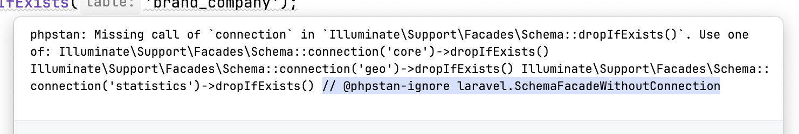

# PHPStan error identifiers in PhpStorm inspection output



## Installation

1. Run `composer require nicksdot/phpstan-phpstorm-error-identifiers`
2. Add the formatter to the `services` config in `phpstan.neon`

```neon
services:
	errorFormatter.checkstyle:
		class:  NickSdot\PhpStanPhpStormErrorIdentifiers\CheckstyleErrorFormatterPhpStorm
```

That's it.

No other changes compared to the [original formatter](https://github.com/phpstan/phpstan-src/blob/5a3990227e64a66b058a96753887e4aa7d411b92/src/Command/ErrorFormatter/CheckstyleErrorFormatter.php#L46) were made. This is a PHPStorm bug, a 
PR to PHPStan was [discussed](https://github.com/phpstan/phpstan-src/pull/4416) but decided against.
